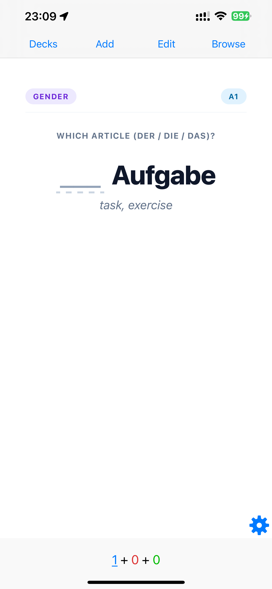
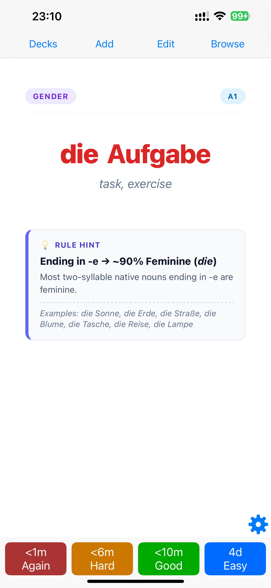
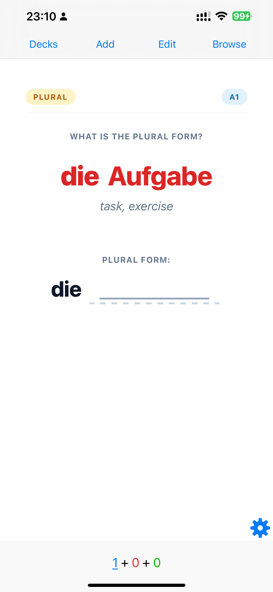
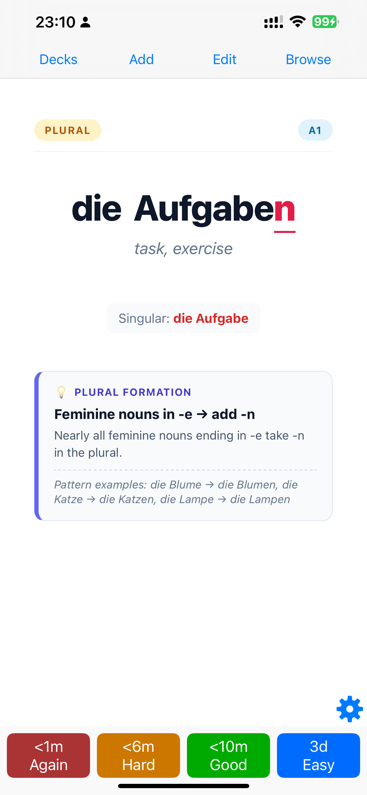

# 🇩🇪 German Nouns Anki Deck Collection (CEFR A1 to C1)

[](https://github.com/yuhouzhou/german-nouns-anki/releases/latest)
[](https://www.python.org/downloads/)
[](https://opensource.org/licenses/MIT)
[](https://apps.ankiweb.net/)

A curated, comprehensive collection of **2,760 German Nouns (5,520 cards)** organized by CEFR level (**A1 to C1**), powered by a 100,000-lemma Wiktionary morphological database, concise 2-tier grammatical rules, automatic morphological plural highlighting, and zero sibling burying.

### 📥 Direct Downloads ([v1.2.0 Release](https://github.com/yuhouzhou/german-nouns-anki/releases/tag/v1.2.0))

| Deck Package | Level | Nouns | Cards | Direct Download |
| :--- | :--- | :--- | :--- | :--- |
| **Complete Bundle** | **A1–C1** | **2,760** | **5,520** | [⬇️ Download .apkg (2.6 MB)](https://github.com/yuhouzhou/german-nouns-anki/releases/download/v1.2.0/german_nouns_A1_to_C1_complete.apkg) |
| **Level A1** | Beginner | 1,111 | 2,222 | [⬇️ Download .apkg (1.1 MB)](https://github.com/yuhouzhou/german-nouns-anki/releases/download/v1.2.0/german_nouns_A1.apkg) |
| **Level A2** | Elementary | 500 | 1,000 | [⬇️ Download .apkg (496 KB)](https://github.com/yuhouzhou/german-nouns-anki/releases/download/v1.2.0/german_nouns_A2.apkg) |
| **Level B1** | Intermediate | 538 | 1,076 | [⬇️ Download .apkg (556 KB)](https://github.com/yuhouzhou/german-nouns-anki/releases/download/v1.2.0/german_nouns_B1.apkg) |
| **Level B2** | Upper-Intermediate | 321 | 642 | [⬇️ Download .apkg (356 KB)](https://github.com/yuhouzhou/german-nouns-anki/releases/download/v1.2.0/german_nouns_B2.apkg) |
| **Level C1** | Advanced | 290 | 580 | [⬇️ Download .apkg (336 KB)](https://github.com/yuhouzhou/german-nouns-anki/releases/download/v1.2.0/german_nouns_C1.apkg) |

---

## 📱 Mobile App Demo (AnkiMobile / AnkiDroid)

| 1. Gender Card (Front) | 1. Gender Card (Back) | 2. Plural Card (Front) | 2. Plural Card (Back) |
| :---: | :---: | :---: | :---: |
|  |  |  |  |
| *Prompt: Article `der/die/das`* | *Reveal: Full color + Gender Rule* | *Prompt: Recall plural form* | *Reveal: Crimson diff + Plural Rule* |

---

## 🌟 Key Features

### 1. 🗂️ Dual Subdeck Architecture (Zero Sibling Burying)
Anki by default buries sibling cards from the same note on the same day. This collection uses **dual independent subdecks** per level so you can study both cards immediately:
- `German Nouns (A1)::1. Gender` — Prompt: *Which article (der / die / das)?*
- `German Nouns (A1)::2. Plural` — Prompt: *What is the plural form?*

```text
▼ German Nouns (A1-C1 Complete)
    ├── ▼ A1 (Beginner)
    │     ├── 1. Gender
    │     └── 2. Plural
    ├── ▼ A2 (Elementary)
    │     ├── 1. Gender
    │     └── 2. Plural
    ├── ▼ B1 (Intermediate)
    │     ├── 1. Gender
    │     └── 2. Plural
    ├── ▼ B2 (Upper-Intermediate)
    │     ├── 1. Gender
    │     └── 2. Plural
    └── ▼ C1 (Advanced)
          ├── 1. Gender
          └── 2. Plural
```

---

### 2. 🎨 Full Color-Coded Reveal
On card reveal, both the definite article and the entire noun light up in vibrant color:
- **Masculine (`der`)** &rarr; **Blue** (`#0284c7` / `#38bdf8`)
- **Feminine (`die`)** &rarr; **Red** (`#dc2626` / `#f87171`)
- **Neuter (`das`)** &rarr; **Green** (`#16a34a` / `#4ade80`)

---

### 3. ✨ Morphological Plural Highlighting
On plural cards, the article `die` is rendered in **neutral black text**, and all morphological changes (Umlaut shifts and suffix endings) are highlighted in **vibrant underlined crimson**:

| Singular | Plural Card Output | Highlighted Changes |
| :--- | :--- | :--- |
| **der Hund** | <span style="font-size: 18px;">die Hund<span style="color:#e11d48;font-weight:bold;border-bottom:2px solid #e11d48">e</span></span> | Suffix **`-e`** |
| **die Altstadt** | <span style="font-size: 18px;">die Altst<span style="color:#e11d48;font-weight:bold;border-bottom:2px solid #e11d48">ä</span>dt<span style="color:#e11d48;font-weight:bold;border-bottom:2px solid #e11d48">e</span></span> | Umlaut **`ä`** + Suffix **`-e`** |
| **das Buch** | <span style="font-size: 18px;">die B<span style="color:#e11d48;font-weight:bold;border-bottom:2px solid #e11d48">ü</span>ch<span style="color:#e11d48;font-weight:bold;border-bottom:2px solid #e11d48">er</span></span> | Umlaut **`ü`** + Suffix **`-er`** |
| **der Baum** | <span style="font-size: 18px;">die B<span style="color:#e11d48;font-weight:bold;border-bottom:2px solid #e11d48">ä</span>um<span style="color:#e11d48;font-weight:bold;border-bottom:2px solid #e11d48">e</span></span> | Umlaut **`ä`** + Suffix **`-e`** |
| **die Möglichkeit** | <span style="font-size: 18px;">die Möglichkeit<span style="color:#e11d48;font-weight:bold;border-bottom:2px solid #e11d48">en</span></span> | Suffix **`-en`** |
| **das Mädchen** | <span style="font-size: 18px;">die Mädchen</span> | No change (clean) |

---

### 4. 💡 2-Tier Glanceable Rule Engine
- **Headline (< 0.5s glance)**: Bold high-level takeaway (e.g. `Suffix -keit ➔ 100% Feminine (die)`).
- **Context**: Rationale and pattern examples.
- **Clean for Root Words**: Pure root nouns without an applicable rule leave the rule box completely hidden.

---

### 5. 🌙 Native iOS & macOS System Dark Mode
- Automatically reacts whenever your iPhone, iPad, or Mac switches between Light and Dark mode via `@media (prefers-color-scheme: dark)`.
- Full-screen edge-to-edge layout customized for **AnkiMobile (iOS)** and **Anki Desktop**.

---

## 📊 Dataset & CEFR Breakdown

Sourced from **Goethe-Institut**, **Profile Deutsch**, **Hathibelagal Lexicon**, and verified against the **100,064-lemma German Wiktionary Morphological Database**:

| Deck Package | CEFR Focus | Noun Count | Card Count | Dual Subdecks |
| :--- | :--- | :--- | :--- | :--- |
| **`german_nouns_A1.apkg`** | **A1 (Beginner)** | 1,111 nouns | 2,222 cards | `1. Gender`, `2. Plural` |
| **`german_nouns_A2.apkg`** | **A2 (Elementary)** | 500 nouns | 1,000 cards | `1. Gender`, `2. Plural` |
| **`german_nouns_B1.apkg`** | **B1 (Intermediate)** | 538 nouns | 1,076 cards | `1. Gender`, `2. Plural` |
| **`german_nouns_B2.apkg`** | **B2 (Upper-Intermediate)** | 321 nouns | 642 cards | `1. Gender`, `2. Plural` |
| **`german_nouns_C1.apkg`** | **C1 (Advanced)** | 290 nouns | 580 cards | `1. Gender`, `2. Plural` |
| **`german_nouns_A1_to_C1_complete.apkg`** | **Master Complete Bundle** | **2,760 nouns** | **5,520 cards** | **10 subdecks** |

---

## 🚀 Quick Start & Installation

### Option 1: Import Pre-built Decks into Anki
1. Download the `.apkg` file from the [Releases](https://github.com/yuhouzhou/german-nouns-anki/releases) section (or build them locally).
2. Double-click any `.apkg` package to import into **Anki Desktop**, **AnkiMobile (iOS)**, or **AnkiDroid**.

### Option 2: Build Decks from Source

1. Clone the repository:
   ```bash
   git clone https://github.com/yuhouzhou/german-nouns-anki.git
   cd german-nouns-anki
   ```

2. Install dependencies:
   ```bash
   pip install genanki
   ```

3. Build all decks:
   ```bash
   # Build all levels (A1 to C1) + master bundle
   python3 src/build_decks.py --all

   # Or build a specific level
   python3 src/build_decks.py --level a1
   ```
   The generated `.apkg` files will be in `output/`.

---

## 🧪 Testing

Run the test suite to verify morphological integrity, deck models, and rule engine accuracy:

```bash
# Run unit & integration tests
python3 tests/test_rules.py
python3 tests/test_deck.py
python3 tests/test_dataset_integrity.py
```

---

## 📄 License

This project is licensed under the MIT License - see the [LICENSE](LICENSE) file for details.
